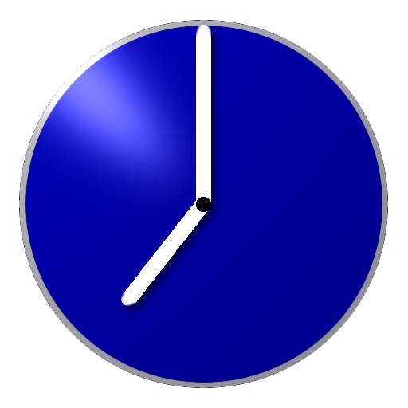
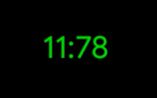
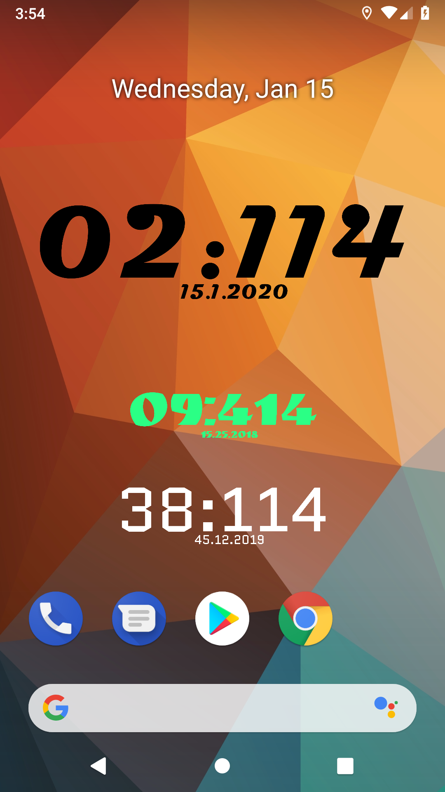
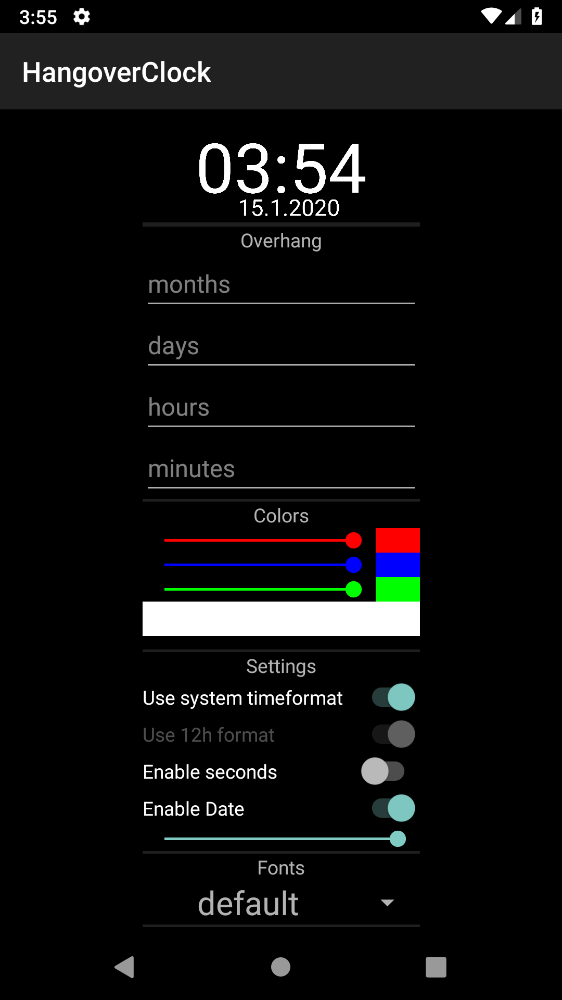
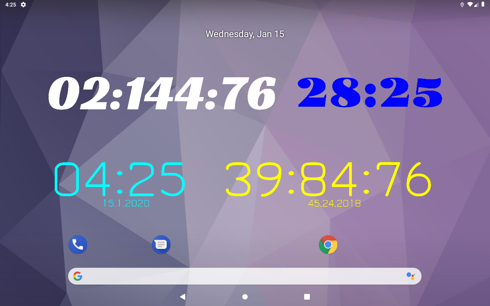
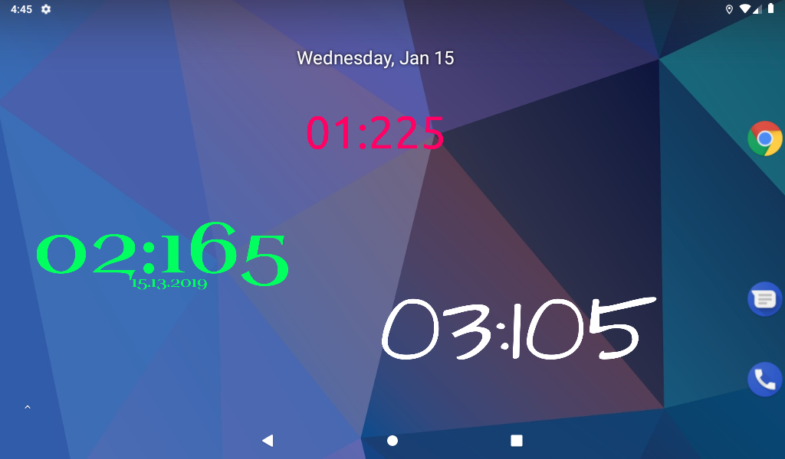
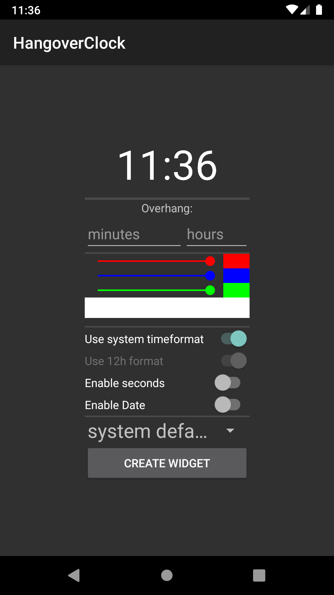
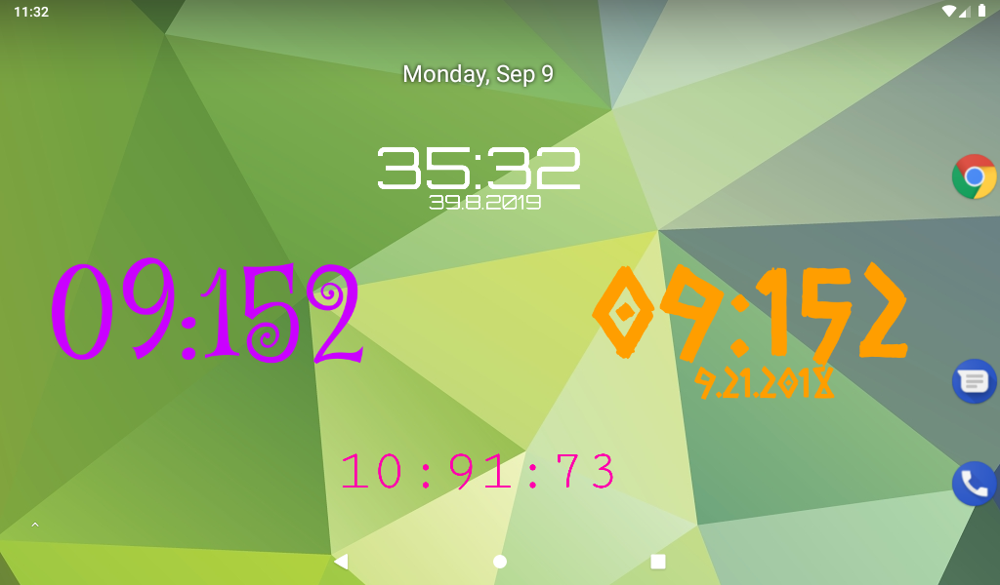

# HangoverClock

Welcome to HangoverClock, the only clock which displays the real time in an unrealistic way!

If you just want to see what this widget looks like now, 
please take a look at the [screenshots](https://github.com/programminghoch10/HangoverClock#screenshots)

[Download from Play Store](https://play.google.com/store/apps/details?id=com.JJ.hangoverclock)

[Download the newest APK](https://github.com/programminghoch10/HangoverClock/raw/master/app/release/app-release.apk)
or look at the
[latest stable releases](https://github.com/programminghoch10/HangoverClock/releases)

For Wear OS Users, please look [here](https://github.com/programminghoch10/HangoverClock/tree/weardev)

## What makes HangoverClock special?

It all started with this meme:

"You will meet your girlfriend today at 11" and the clock shows 10:65.

Its obvious that 10:65 would actually be 11:05.
I thought this needs to become real.

My first test of this was my [Stopwatch](https://github.com/programminghoch10/Stopwatch).

To describe how many minutes the clock should go over the full hour, I used the word "Overhang". 
An Overhang of 0 would result in the clock being totally normal. 
Any Overhang above 0 would result in the clock counting over 60 until the Overhang is reached, at which point it shows the real time again. 
E.g. With an overhang of 10 the clock would go up to 10:69 and the next minute to 11:10.
Of course you could also go insane with this setting, which results in ridiculous clocks like 03:384829323 
(Yes my friend [@IlijazM](https://github.com/IlijazM) actually did that). 

And because of that variable, which makes the clock unique, its named HangoverClock.

&nbsp;

***Special info for 12h users:***

Overhang calculation turns out to be really difficult and confusing in the 12h format.
That's why whole calculation happens in 24h format and then gets later subtracted down,
if the hour is between 12+houroverhang and 24.
Try setting houroverhang to 0 or 1 and watch what suits you better.
*This behaviour is only relevant when using the date,* 
so please remember that using the 12h setting may not reflect the real time!
But maybe nobody will notice...

## Good old times

This was HangoverClock "Toxic". A simple widget which displayed the time.
You were able to modify the Overhang, by clicking in the middle once. 
Then the current overhang was displayed and you could increase or decrease it by clicking the + or - button.
Also the text was always the same size, no matter how big the widget was resized too.

So my friends inspired me saying the idea is amazing, but the clocks design sucks. So I needed to do something about it.

## Big steps forward

(background not included)

Here is HangoverClock "Dynamite".

Dynamite brings a lot of new features: 
First of there are fonts. Around 20 fonts (more incoming) are just waiting for amazing clock widgets to be created.
With the freely choosable color (16.777.216 combinations) you can select the most fitting for your background.
And you can enable a date to be shown below the clock, which **also has the ability to overhang**!
Also you can now choose whether to use 12 or 24h time format, or use the system setting.

When creating the widget on your home launcher the app greets you with a settings menu, 
which lets you easily set up the widget as you like it.

Also you are now able to not choose one Overhang, but all 4 seperatly. Those are:
* Minutes
* Hours
* Days
* Months

Same thing as always, 
hours defines how much to go over 12/24h mark, 
days defines how much to go over a month
and months defines how much to go over a year.

[@IlijazM](https://github.com/IlijazM) im expecting you to live in 2017 :)

## The next generation

Now comes HangoverClock "Serenity":

Serenity comes with quite some overhauls and extra features.

The biggest new thing is the addition of a daydream/screensaver.
You now have the possibility to use HangoverClock as always on display if your phone is charging or in the dock.

And here are some of the smaller changes:
* The seconds overhang can now be configured 
* 10+ new fonts have been added
* The configure menu now saves your settings
* The widget is now available on lockscreens too _(depends on your device)_

Many performance improvements have been made, such as that the clock now manages numbers up to 2^31 (‭2.147.483.648‬) with great efficiency when date is disabled.

## The Future

You can see my plans for this app [here](plans.md).

I'm always on the quest to make this the best HangoverClock ever.

## Code Stuff

* All calculations happen inside the class `ClockGenerator`. 
* The only public method is `generateWidget`, which returns a Bitmap Image.
* The fonts get dynamically collected from all available resource files 
    and saved in a static String array within the `FontsProvider` class.
* The resulting bitmap resolution will be calculated to reach the best quality possible on every device.
* The sharedPreference keys are defined in `*keys.xml` and their defaults in `*keydefaults.xml`.
  * sharedPreferences are saved in following format: key and if needed a directly appended widget ID.
  * If a key is not defined its default value is assumed and only gets saved when not default or when `alwayssavepreferences` bool is active.
* if one of the widgets has seconds enabled, the `setalarmmanager` method will request intent for one second instead of one minute.
  * That behaviour is dependent on sharedPreferences key `increaserefreshrate`.
  * That key will be determined on every clock update by looping though all widgets and looking if any has seconds enabled.

## License

You can see the current license [here](LICENSE.md).

## Thanksgiving

Thanks to all my friends, who motivated me to do this.

Also thanks to my laptop, which crashed 2 times with literally nothing saved to disk.

&nbsp;

## Screenshots

